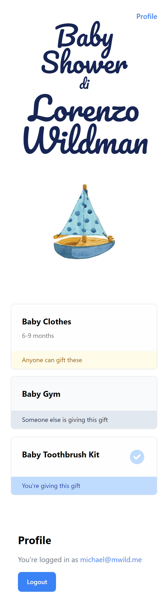

# baby-shower-di-lorenzo

I was looking for a gift registry for our baby shower and the first page of Google results were all platforms which want to drive sales via affiliate links. 
I wanted something super simple that could just list the gifts for people to source however they wish.

## Setup

The app uses Supabase for pretty much everything, with a small Vue3 UI on top of the PostgREST API.

1. Set up a new Supabase project
1. Run the schema.sql script to create the db schema (and REST API etc)
1. Set the `VITE_SUPABASE_URL` and `VITE_SUPABASE_KEY` in the .env file
1. `npm install`
1. `npm run dev`

## Preview

